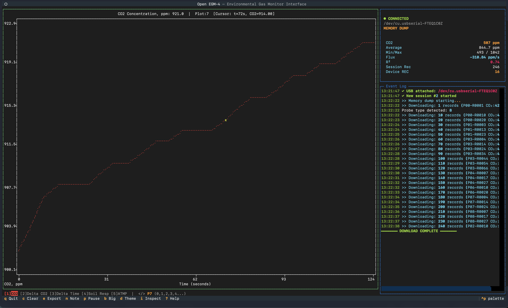
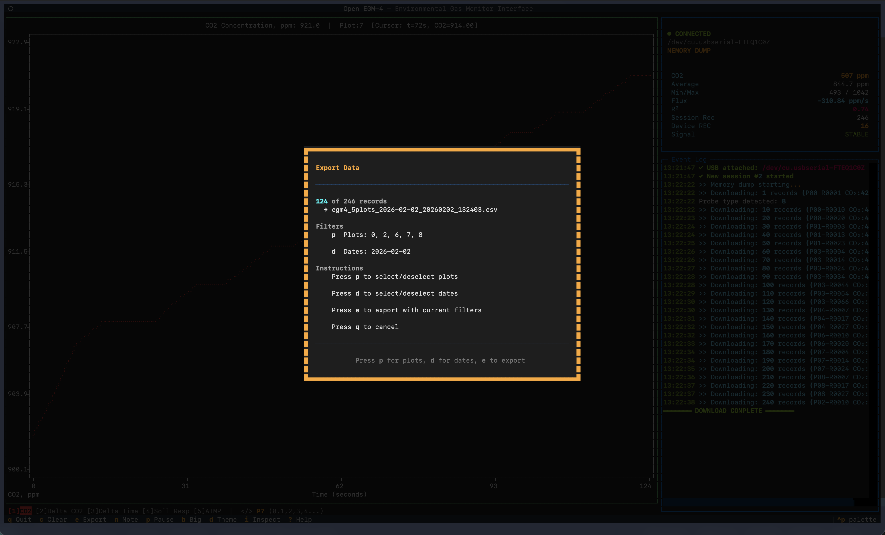

# Open EGM-4

A terminal user interface for the PP Systems EGM-4 Environmental Gas Monitor.


<p align="center">
  
  
  
</p>

## Features

- Real-time CO₂ charting with multi-channel support
- Session persistence with automatic database saving and resuming
- Automatically detects and supports all probe types, including SRC-1
- Data filtering based on plot number
- Exporting data to a .csv with plot and date filters
- Status indicators for warmup temperature and zero checking

## Installation & Updating

The easiest way to install or update Open-EGM4 is using the automatic installer script:

**macOS / Linux:**
```bash
curl -sSL https://raw.githubusercontent.com/mmorgans/open-egm4/main/install.sh | bash
```

**Windows (PowerShell):**
```powershell
irm https://raw.githubusercontent.com/mmorgans/open-egm4/main/install.ps1 | iex
```
If open-egm4 is already installed, running the script again will allow you to update, repair, or uninstall the software.
The installer now also shows your currently installed version and the latest available release version before you choose an action.
After installation, simply run:

```bash
open-egm4
```

For more information on this project and the EGM-4 itself, or for detailed installation instructions, see [the article I wrote here](https://docs.mor-gan.com/posts/using-the-egm-4/).

### Manual Installation

If you prefer to install manually, you can use `pipx` (recommended) or `pip`:

```bash
# Using pipx (recommended for isolation)
pipx install git+https://github.com/mmorgans/open-egm4

# Using standard pip
pip install git+https://github.com/mmorgans/open-egm4
```

> If the `open-egm4` command is not found after manual installation, ensure your python bin directory is in your PATH, or run using `python3 -m src.tui.app`.

> For more help installing, [see this guide](https://docs.mor-gan.com/posts/using-the-egm-4/).

### For Developers

If you want to modify the code:

```bash
git clone https://github.com/mmorgans/open-egm4
cd open-egm4
python -m venv venv
source venv/bin/activate  # On Windows: venv\\Scripts\\activate
pip install -e .
# or with test tooling:
pip install -e ".[dev]"
```


Run with:
```bash
open-egm4
# or
./venv/bin/python main.py
```

Run tests:
```bash
pytest -q
```

The monitor stats panel now includes quick data-health counters:
- `Parsed/Err` - successfully parsed measurement records vs malformed/unknown records
- `Reconnects` - USB reconnect events detected during the session
- `Serial Err` - serial-layer errors reported during the session

### Installation Troubleshooting

#### macOS: "python: command not found"

On macOS, use `python3` and `pip3` instead of `python` and `pip`:

```bash
python3 --version
pip3 install .
```

#### macOS: "pip: command not found"

If pip isn't installed, run this to install it:

```bash
python3 -m ensurepip --upgrade
```

Alternatively, install Python via Homebrew which includes pip:

```bash
brew install python@3.13
```


## Platform Notes

### Linux

You may need to add your user to the `dialout` group to access serial ports:

```bash
sudo usermod -a -G dialout $USER
```

Log out and back in for the change to take effect.

### Windows

USB-to-serial adapters may require driver installation. Ports appear as `COM1`, `COM3`, etc.

### macOS

USB-to-serial adapters should work automatically. Ports appear as `/dev/cu.usbserial-*`.

## Keyboard Shortcuts

### Monitor Screen

| Key | Action |
|-----|--------|
| `q` | Quit and save data automatically |
| `e` | Export to CSV with plot and date filters |
| `c` | Clear chart data |
| `p` | Pause or resume data stream |
| `m` | Toggle static sampling mode |
| `n` | Add note (or advance static sample step) |
| `x` | Reset static sample cycle |
| `?` | Help screen |

### Chart Controls

| Key | Action |
|-----|--------|
| `.` / `>` | Next plot |
| `,` / `<` | Previous plot |

### Connect Screen

| Key | Action |
|-----|--------|
| `↑` / `↓` | Navigate port list |
| `Enter` | Connect to selected port |
| `s` | Resume previous session |
| `q` | Quit |

## EGM-4 Device Operation

For a much more detailed overview of the EGM-4 and how to use it, see [the article I wrote.](https://docs.mor-gan.com/posts/using-the-egm-4/)

### Dumping Stored Data

1. Press `4` on the EGM-4 for DMP
2. Press `2` for DATA DUMP
3. Press any key to start dump

### Live Measurements

1. Press `1` on the EGM-4 for REC.

### Device Warmup

When the EGM-4 is warming up, you'll see `WARMUP: XXC` until it reaches operating temperature around 55°C.

### Zero Check

During zero check, you'll see `ZERO CHECK: Xs` counting up to 15 seconds before you can take a measurement.

## Output Files

| File | Description |
|------|-------------|
| `~/.open-egm4/egm4_data.sqlite` | Session database, auto-saved, enables resume |
| `raw_dump_YYYY-MM-DD.log` | Raw serial data, auto-saved each session |
| `egm4_data_YYYYMMDD_HHMMSS.csv` | Exported, parsed data export with all fields |

### CSV Columns

The exported CSV includes all fields from the EGM-4 record format:

- `timestamp` - When the record was received
- `type` - M for real-time or R for memory
- `plot`, `record` - Plot and record numbers
- `day`, `month`, `hour`, `minute` - Device timestamp
- `co2_ppm`, `h2o_mb`, `rht_c`, `temp_c` - IRGA readings
- `par`, `rh_pct` - Probe measurements
- `dc_ppm`, `dt_s`, `sr_rate` - Change in CO₂ and respiration rate
- `atmp_mb`, `probe_type` - Atmospheric pressure and probe code
- `note` - Free-form note text
- `sample_id`, `sample_label`, `sample_ppm`, `sample_peak_ppm` - Static sampling metadata

Pressing `n` in normal mode creates `NOTE` rows in CSV exports (not just the event log).

### Static Sampling Mode

Press `m` on the monitor screen to toggle static sampling mode.  
When enabled, the stats panel shows `STATIC SAMPLING` and the current step prompt.
Press `n` to advance the current step:

1. Inject sample gas, then press `n`
2. Wait for settling after pressure spike, then press `n` to capture
3. Enter optional sample label
4. Inject ambient air flush, then press `n`

Press `x` anytime to reset to step 1.

Sample events are:
- visible in the event log
- marked on the chart
- included in CSV export rows (`type=SAMPLE`) with both settled and peak ppm

## Release Process

Releases are tag-driven via `setuptools_scm`:

1. Ensure `main` is clean and CI is passing.
2. Create and push a tag: `git tag vX.Y.Z && git push origin vX.Y.Z`
3. GitHub Actions runs CI across supported Python versions.
4. Use the GitHub Release page for notes/changelog summary.

## License

MIT License - See LICENSE file for details.
